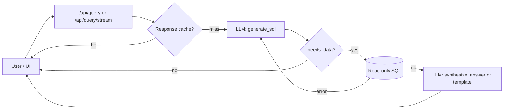

# Forecast Query Engine — Architecture (concise)

## Stack

| Layer | Technology |
|--------|------------|
| API | FastAPI (`app.py`) |
| LLM | AWS Bedrock Runtime (`llm.py`) — Nova / Claude / Llama families |
| Data | Amazon Aurora PostgreSQL via `psycopg2` pool (`db.py`) |
| UI | Static HTML + JS in `static/` (Plotly for charts) |

## Request flow

1. **Cache** — Identical questions (normalized) may return a cached answer (TTL in `config`).
2. **generate_sql** — Bedrock returns JSON: SQL + params, or a direct answer if no DB is needed.
3. **execute_query** — `db.py` enforces read-only rules, keyword blocklist, structure checks on large tables, timeouts, and cancellation by `request_id`.
4. **synthesize_answer** — Second Bedrock call (often a smaller/faster model) turns rows + stats into narrative + optional Plotly chart JSON. Skipped for tiny results (few rows/columns) to save latency.

## LLM roles

| Step | Role | Model |
|------|------|--------|
| NL → SQL | System prompt from `schema.py` (schema + domain rules) + conversation | `BEDROCK_MODEL_ID` |
| Answer + chart | Summarize query results (sampled rows + column stats) | `BEDROCK_SYNTH_MODEL_ID` |

Auth: **IAM** (e.g. EC2 instance profile), not API keys in code.

## Other processes

- **Sessions** — In-memory history per `session_id` (trimmed to last N turns).
- **Streaming** — `POST /api/query/stream` emits SSE events (`sql_ready`, `data_ready`, `complete`, etc.).
- **Cancel** — `POST /api/cancel` flags the request and cancels the DB backend PID.

## Key files

| File | Responsibility |
|------|----------------|
| `app.py` | Routes, orchestration, cache, SSE |
| `llm.py` | Bedrock invoke, JSON parse, synthesis prompts |
| `db.py` | Pool, validation, read-only enforcement |
| `schema.py` | Prompt context for correct SQL |
| `config.py` | Env-based settings |
